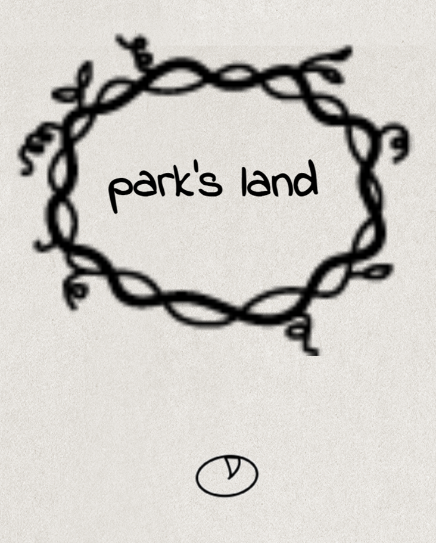
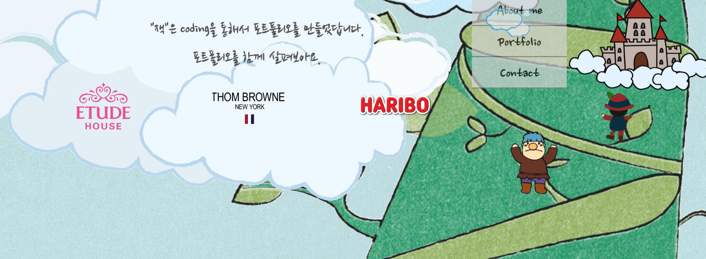
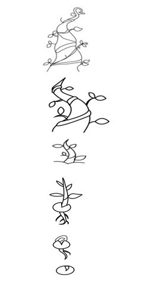

# 잭과 콩나무 🌱  

### ✅제작 의도   
#### "성장하는 사람"   
 어제보다 오늘이, 오늘보다 내일 더 **나아지고 성장하는 사람이 되자**는 삶의 태도를 담았다.   

앱의 모티브가 된 이야기는 *잭과 콩나무*이다. 이 이야기를 선택한 이유는
1) **성장**을 **나무**를 통해서 시각적으로 표현하고   
2)  소를 키우던 잭에게 콩나무가 새로운 세상을 연결해줬듯이,   

    코딩을 통해 새로운 세상으로 나아가고자 함을 표현하고 싶었기 때문이다.   

###  ✅완성페이지   
1. **첫화면**

 

2. **메인1**

3. **메인2**

4. **메인3**
   

### ✅주요 기능 및 특징   
1. 동화적인 느낌     
   * 구어체 사용으로 앱과의 통일성 유지   
   * 메뉴, 잭, 거인 등 다양한 이미지 활용   

     
     
        
        
        

2. 성장하는 나무를 통한 동적인 모습 전달   
   * Illustrator 작업
     | |  |
     |---|---|

  ### ✅기술스택   
  * HTML , CSS , Jquery
